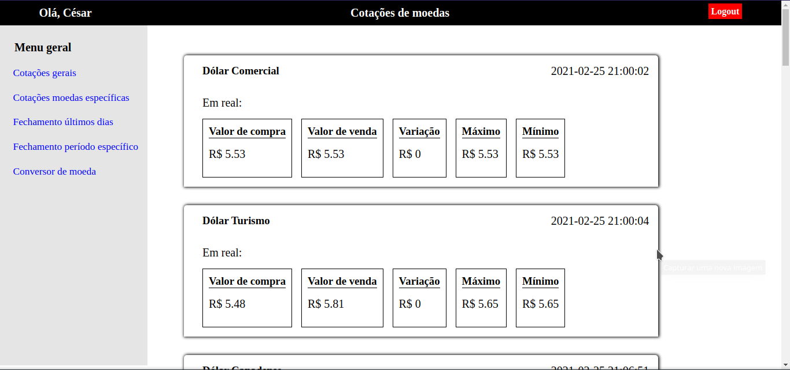
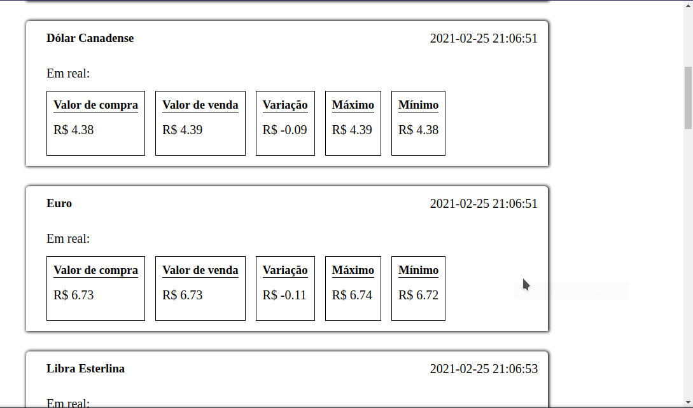
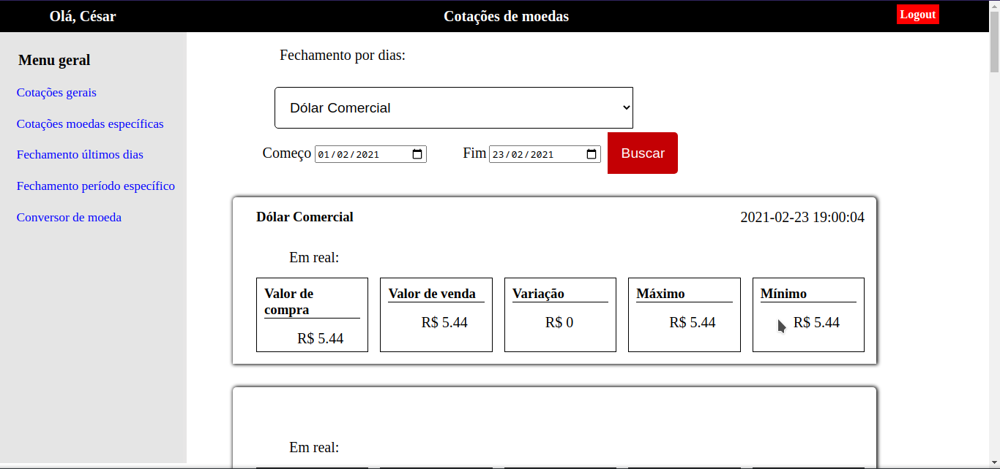
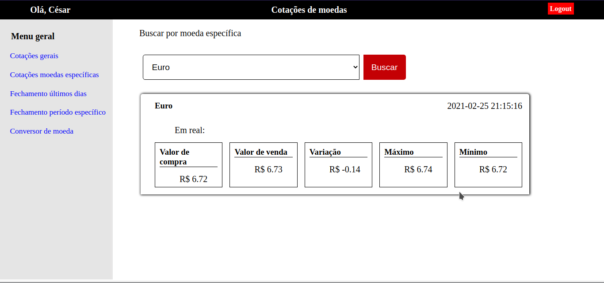

# CotacoesDeMoedas-PHP-Api
 Projeto web para buscar informações sobre cotações de moedas de diversos países, utilizando PHP e a Api awesomeapi-cotações de moedas.

  <a target="_blank" href="https://docs.awesomeapi.com.br/api-de-moedas">Documentação da awesomeapi cotações de moedas</a> 

  <h3>Requisitos:</h3>
    <blockquote>
       Ter o curl instalado (em sistemas operacionais linux por exemplo). E nos demais ter as extensões <code>extension=curl.so</code> <code>extension=curl</code> ativados no arquivo ini do seu php. <a href="https://www.php.net/manual/pt_BR/curl.installation.php">Como aplicar os procedimentos de acordo com sistema operacional</a>
    </blockquote>
 <h3>Instalação: </h3>
<blockquote>
    clonar este repositório para a pasta do seu servidor (xampp, wamp,lamp ou algum de sua preferência) e criar um virtual host para esse projeto (devido ao sistema de rotas se faz necessário), e executar apartir do localhost. Caso utiliza o servidor do php (indicado para esse projeto devido ao sistema de rotas) basta navegar até a pasta do projeto pelo cmd e digitar o comando: <code>php -S localhost:8080</code>. Também é necessário alterar os Parâmetros de conexão na pasta <code>App/Core/Model</code> e importar o arquivo <code>db/cotacoesMoedas.sql para o seu mysql</code>

</blockquote>

<h3>Imagens do projeto</h3>

<figure>
 	<figcaption>Listando cotações gerais</figcaption>
    
    
</figure>
<figure>
 	<figcaption>Fechamento em intervalo de dias específicos</figcaption>
    
</figure>
<figure>
 	<figcaption>Busca por cotação do dia de moeda específica</figcaption>
    
</figure>